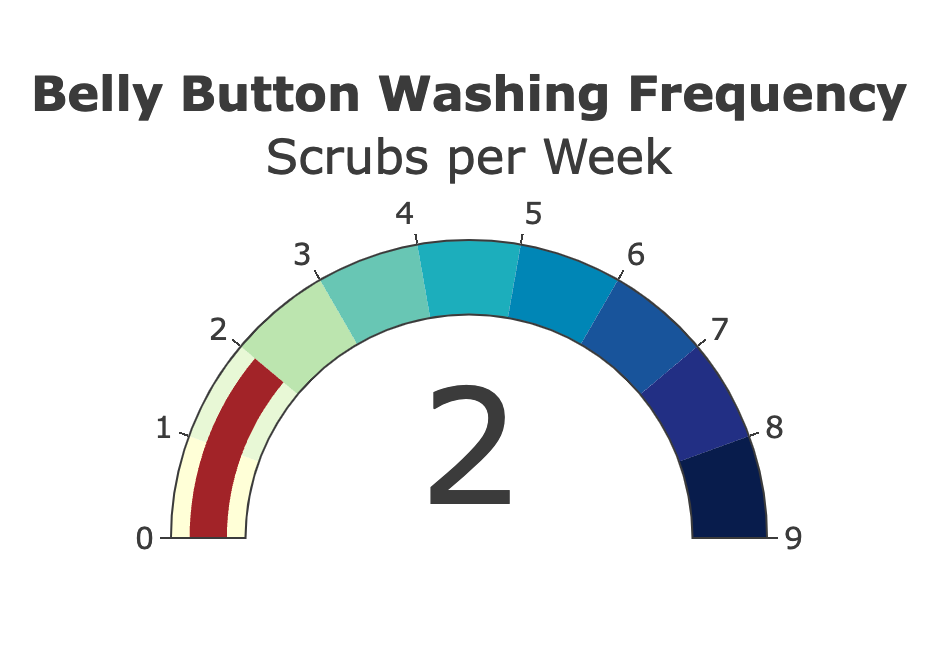

# Belly Button Biodiversity Dashboard
This interactive dashboard explores the Belly Button Biodiversity dataset, which catalogs the microbes that colonize human navels. A small number of microbial species (OTUs - operational taxonomic units) are present in more than 70% of people, while others are relatively rare. This dashboard provides a visual representation of the microbial diversity for individual samples.

**Link to Github Pages** <https://abdullamashaly.github.io/belly-button-challenge/>

## Overview

The dashboard is built with JavaScript using the D3 library to fetch and parse data, and Plotly for rendering interactive charts.

## Features

1. Dropdown Menu: Lists all the individual sample IDs. When an ID is selected, the dashboard updates with data corresponding to the chosen sample.

2. Demographic Information Panel: Displays metadata about the selected individual.

3. Horizontal Bar Chart: Displays the top 10 OTUs for the selected individual.

4. Bubble Chart: Visualizes the sample's OTU distribution.

5. Gauge Chart: Represents the weekly washing frequency of the selected individual.

## Dashboard Details
1. Fetching Data: Used the D3 library to read in samples.json from the provided URL.
2. Bar Chart:
    - Display the top 10 OTUs for the selected sample.
    - Use sample_values for bar heights.
    - Use otu_ids as labels.
    - otu_labels should appear as hovertext.
3. Bubble Chart:
    - otu_ids for the x-axis.
    - sample_values for the y-axis and marker size.
    - otu_labels for hovertext.
4. Demographic Information Panel: Displays each key-value pair from the selected sample's metadata.
5. Dashboard Refresh: Ensures all plots and the information panel update when a new sample is selected from the dropdown menu.
6. Gauge Chart:
    - Adapts the gauge chart from Plotly's documentation to display the individual's weekly washing frequency.

## Source code:
- [Guage Charts using Plotly](https://plotly.com/javascript/gauge-charts/#basic-gauge)
- [Bootstrap docs](https://getbootstrap.com/docs/5.3/getting-started/introduction/)
- [Plotly Documentation](https://plotly.com/javascript/)
- [D3 Documentation](https://d3js.org/d3-selection)
- [html onchange](https://stackoverflow.com/questions/5024056/how-to-pass-parameters-on-onchange-of-html-select)

## References:
Hulcr, J. et al. (2012) A Jungle in There: Bacteria in Belly Buttons are Highly Diverse, but Predictable. Retrieved from: <http://robdunnlab.com/projects/belly-button-biodiversity/results-and-data/>
